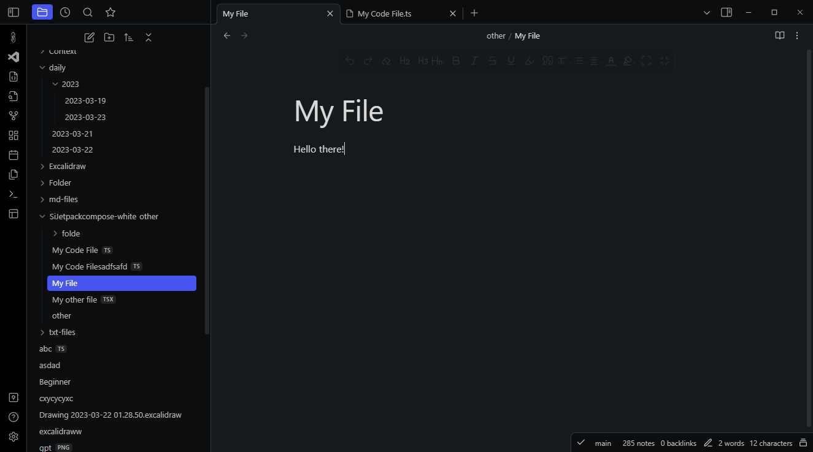
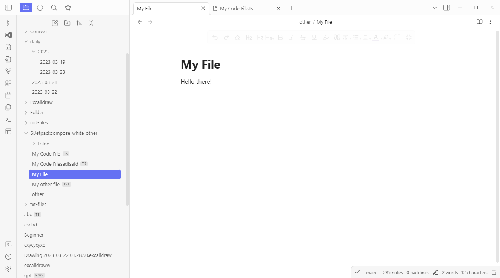

# Obsidian Proper Dark Theme

> Theme for ObsidianMD with darker backgrounds and more colorful features.

The theme implements darker colors when in dark mode, and adds the primary color in some additional places, like
in context menus and the actively selected file or active tabs. It also includes some visual tweaks to the editing
toolbar styling.

Can also be used in light mode, where just the primary color is added to additional places.

The accent color used in the screenshots is `#5865F2`.
